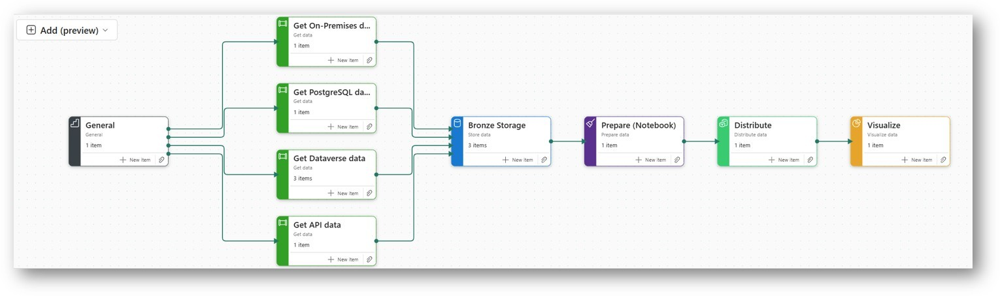

# nr-dap-azure

## Folder Structure

    nr-dap-azure/
    ├── scripts/
    │   └── pipelines/
    │       ├── FromAPI_Pipeline/
    │       ├── FromOnPremises/
    │       └── Orchestration/
    ├── src/
    │   └── notebooks/
    ├── data/
    │   └── your-pqt-file.pqt
    ├── devops/
    └── docs/
        └── images/

Exported files from pipelines, Dataflow gen2, notebook and power query template received from Microsoft after PoC demo of the software. The exports will allow Data Foundations to have something to start with once Fabric is enabled. Various ID's replaced with `{placeholder}`.

A connectino will be needed to setup.

For on-premises data sources, one will need to install and setup Data Gateway: https://learn.microsoft.com/en-us/power-bi/connect-data/service-gateway-data-sources

